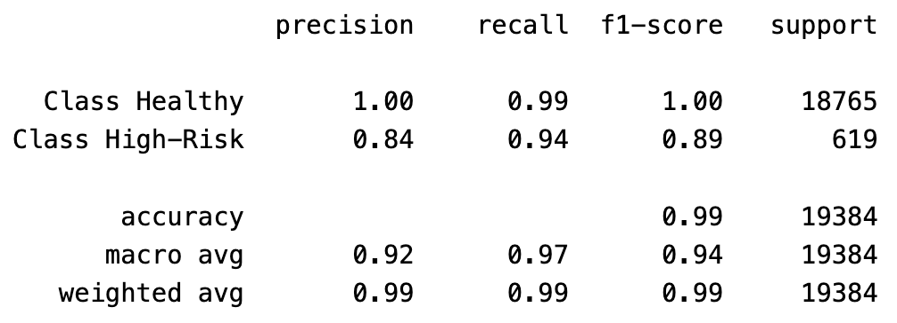

# credit-risk-classification

## Background

In this assignment, we use various techniques to train and evaluate a model based on loan risk. We use a dataset of historical lending activity from a peer-to-peer lending services company to build a model that can identify the creditworthiness of borrowers.

## Overview of the Analysis

The analysis encompasses using a logistic regression machine learning model to predict a borrower's creditworthiness, i.e. the probability that a borrower's loan is healthy or high-risk.

We are provided with a CSV file containing 77,536 records with the columns:

* loan_size
* interest_rate
* borrower_income
* debt_to_income
* num_of_accounts
* derogatory_marks
* total_debt
* loan_status

We begin the analysis by separating the data into the input data, also known as features, and the output variable (label) we are tryng to predict, in this case `loan status`.

Once the features and label are properly separated, we split the data into a training dataset and testing dataset.  A logistic regression model is fitted using the training dataset.  We then use the model to make predictions using the testing dataset.

Finally, we evaluate the model's performance by generating a confusion matrix and a classification report.

## Results

### Confusion Matrix

* **18658 True Negatives (TN):** The model correctly predicted class 0 (healthy) for 18658 data points.

* **1 False Positive (FP):** The model incorrectly **predicted class 1 (high-risk)** for a data point that actually **belonged to class 0** (healthy).

* **37 False Negatives (FN):** The model did not incorrectly predict class 0 (healthy) for any data points that actually belonged to class 1 (high-risk).
  
* **582 True Positives (TP):** The model correctly predicted class 1 (high-risk) for 582 data points.
  
### Classification Report

**Precision:**

* **Class Healthy:** 1.00 means that all the instances predicted as Class Healthy were actually Class Healthy (no false positives).
* **Class High-risk:** 0.84 means that 84% of the instances predicted as Class High-Risk were actually Class High-Risk (16% were false positives).

**Recall:**

* **Class Healthy:** 0.99 means that 99% of all actual Class Healthy instances were correctly identified by the model (1% were false negatives).
* **Class High-Risk:** 0.94 means that 94% of Class High-Risk instances were correctly identified by the model (6% were false negatives).

**F1-Score:**

* **Class Healthy:** This metric combines precision and recall. For the Healthy class, the F1-score is near perfect at 1.00.
* **Class High-Risk:** 0.89 is still strong but reflects the slightly lower precision compared to recall.

## Summary Analysis

1.	Model Performance:
* The overall accuracy of the model is 99%, indicating excellent performance in predicting both “Healthy” and “High-Risk” borrowers.
* The **macro average** F1-score is 0.94, reflecting the model’s balanced performance across both classes. The **weighted average** F1-score is 0.99, highlighting the dominance of the “Healthy” class in the dataset and the model’s strong performance in predicting that class.
2.	Class Imbalance:
* There is a significant imbalance between the classes: 18,765 “Healthy” loans compared to only 619 “High-Risk” loans. This imbalance can explain the model’s high overall accuracy and strong performance in predicting “Healthy” loans.
3.	High-Risk Loan Detection:
* Although the “High-Risk” precision is lower at 0.84, the high recall (0.94) suggests that the model effectively captures most of the actual high-risk cases, which is critical in a lending context.
* The F1-score of 0.89 for “High-Risk” loans shows that the model balances precision and recall well, though there is still room for improvement in reducing false positives (incorrectly classifying healthy loans as high-risk).

## Conclusion

The model performs exceptionally well overall, especially in predicting healthy loans. It also handles high-risk loans reasonably well, although some misclassifications (false positives for high-risk) occur. Further improvements could focus on refining the model’s ability to differentiate high-risk borrowers more accurately to avoid false positives while maintaining high recall.

## Files and Folders

1. **[`credit_risk_classification.ipynb`](https://github.com/blmccourt/credit-risk-classification/blob/main/Credit_Risk/credit_risk_classification.ipynb)**

- Jupyter notebook with python code.

2. **[Images](https://github.com/blmccourt/credit-risk-classification/tree/main/Images)**

- Folder with images used in notebook.

3. **[Resources](https://github.com/blmccourt/credit-risk-classification/tree/main/Credit_Risk/Resources)**

- Folder with the provided CSV lending dataset.